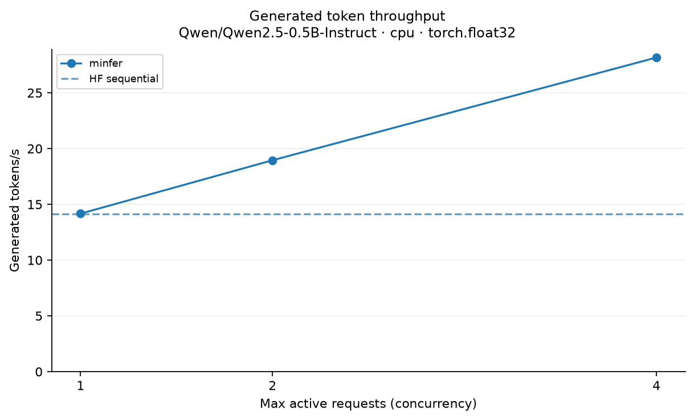
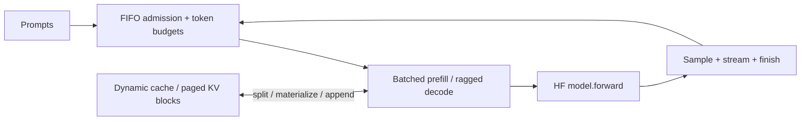

# minfer

An educational single-device LLM inference engine for exploring manual generation,
continuous batching, token-budget scheduling, and KV memory management. Hugging Face
supplies the Transformer; minfer owns the generation loop and never calls
`model.generate()` in its engine path.

- Batched prompt prefill and ragged continuous decode batching
- Deterministic FIFO admission with request, per-step token, and KV capacity limits
- Dynamic caches or fixed-size paged KV storage with inspectable block tables and metrics
- CPU, MPS, and CUDA device abstraction
- Greedy / temperature / top-k / top-p sampling and streaming events
- Correctness oracles, reproducible benchmarks, and JSON-driven charts and reports

## Representative benchmark

**Qwen2.5-0.5B-Instruct · CPU float32 · macOS arm64**, four unequal prompts
(38/45/75/59 tokens), up to eight output tokens each, one warmup, dynamic cache mode.
Measured on 2026-10-02; all engine outputs matched the controlled HF reference.

| Method | Tokens/s | p50 TTFT (ms) |
| --- | ---: | ---: |
| HF sequential | 14.12 | 956.19 |
| minfer · 1 active | 14.17 | 936.28 |
| minfer · 2 active | 18.95 | 550.70 |
| minfer · 4 active | 28.16 | 222.57 |



Model loading is excluded; queueing is included. Small smoke runs describe this workload,
not general performance. [Raw JSON](benchmarks/results/cpu-budget-dynamic.json) ·
[Generated report](benchmarks/reports/cpu-budget-dynamic/report.md) ·
[Paged-mode report](benchmarks/reports/cpu-budget-paged/report.md) ·
[Historical MPS results](benchmarks/results/mps-historical.json)

## Quickstart

Requires Python 3.11–3.13 and [uv](https://docs.astral.sh/uv/).

```bash
git clone https://github.com/harshb16/minfer.git
cd minfer
uv sync --locked
uv run minfer generate --prompt "Explain KV caching" --max-new-tokens 64

# Repeat --prompt to submit multiple requests; limits count real token slots.
uv run minfer generate --prompt "Explain prefill" --prompt "Explain decode" \
  --max-active-requests 4 --max-batched-tokens 256 --max-kv-tokens 1024 \
  --cache-mode paged --kv-block-size 16 --num-kv-blocks 64 --max-new-tokens 32
```

The first run downloads **Qwen/Qwen2.5-0.5B-Instruct**. Automatic device selection is
CUDA → MPS → CPU; override with `--device cpu`, `--device mps`, or `--device cuda:0`.
The CLI applies the instruction chat template by default; `--raw-prompt` disables it.

```python
from minfer import LLMEngine, SamplingParams

engine = LLMEngine(max_active_requests=4, max_batched_tokens=256, max_kv_tokens=1024)
results = engine.generate_batch(
    ["Explain prefill.", "Explain decode."], SamplingParams(max_new_tokens=32)
)
print(results[0].text)
print(engine.scheduler.usage())
```

## Architecture



Each step reserves decode work first, then admits whole FIFO prompts from the remaining
token budget. Newly admitted requests emit their first token and start decoding on a
later step. Every request emits at most one token per step. Completion releases its
cache or block ownership immediately. Admission conservatively reserves worst-case
output growth, preventing KV exhaustion without preemption.

[Architecture and scheduler](docs/architecture.md) · [Paged KV storage](docs/paged-kv.md) ·
[Benchmark methodology and plotting](docs/benchmarks.md) · [Validation record](docs/validation.md)

## Validate and benchmark

```bash
uv run pytest
uv run pytest -m integration
uv run ruff check .
uv run ruff format --check .
uv build
uv run python -m benchmarks.benchmark --device cpu --requests 4 \
  --concurrency 1 2 4 --max-new-tokens 8 --cache-mode paged \
  --output benchmarks/results/example.json
uv run python -m benchmarks.plot benchmarks/results/example.json \
  --output-dir benchmarks/reports/example
```

Matplotlib is a development dependency; runtime generation does not require it.
The fast suite uses a tiny HF Qwen model and synthetic caches. Canonical checkpoint
tests verify CPU/MPS logits, caches, and exact greedy token parity. CUDA is supported
by the abstraction but has not been tested on this machine.

## Limitations

Paged KV storage **is not PagedAttention**: HF attention receives a materialized,
contiguous DynamicCache. Copies, padding, and a full backing block pool add overhead;
token limits do not bound raw GPU bytes or transient allocations. Reservations can
underuse capacity, and a blocked FIFO head prevents later prompts from overtaking.
Only Qwen2.5-0.5B-Instruct is verified. No custom kernels, chunked prefill, preemption,
prefix caching, speculative decoding, distributed inference, quantization, or HTTP serving.
