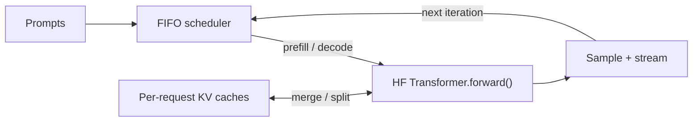

# minfer

A minimal single-device LLM inference engine inspired by vLLM for exploring KV caching, request scheduling, and continuous decode batching.



## Key features

- ✓ Manual autoregressive loop with explicit prefill and decode
- ✓ KV-cache reuse and independent request caches
- ✓ Continuous decode batching with requests joining and leaving
- ✓ Ragged KV batching for unequal sequence lengths
- ✓ MPS, CUDA, and CPU support
- ✓ Greedy / temperature / top-k / top-p sampling and streaming token events

## Benchmarks

Measured with **Qwen2.5-0.5B-Instruct on Apple Silicon MPS, float16**: eight unequal-length prompts, up to 32 new tokens per request, 255 generated tokens total, and one warmup run.

| Method | Wall time (s) | Tokens/s | Median TTFT (s) |
| --- | ---: | ---: | ---: |
| Hugging Face sequential | 3.44 | 74.0 | 1.56 |
| minfer · 1 active | 5.37 | 47.5 | 2.39 |
| minfer · 2 active | 3.92 | 65.1 | 1.57 |
| minfer · 4 active | 2.48 | 102.8 | 0.71 |

TTFT is time to first token. Queueing is included; model loading is excluded. Results depend on workload and hardware. [Raw results](benchmarks/results/mps-historical.json) · [Methodology](docs/architecture.md#benchmarks) · [CPU/MPS smoke reports](benchmarks/results/)

## Quick start

Requires [uv](https://docs.astral.sh/uv/). The first generation run downloads the checkpoint.

```bash
git clone https://github.com/harshb16/minfer.git
cd minfer
uv sync --locked

uv run minfer generate --prompt "Explain KV caching" \
  --max-new-tokens 64 --temperature 0
```

The default model is **Qwen/Qwen2.5-0.5B-Instruct**. Device selection is CUDA → MPS → CPU; override with `--device mps`, `--device cuda:0`, or `--device cpu`. Repeat `--prompt` to submit multiple requests, or use the Python API:

```python
from minfer import LLMEngine, SamplingParams

engine = LLMEngine(max_active_requests=4)
result = engine.generate("Explain continuous batching.", SamplingParams(max_new_tokens=64))
print(result.text)
```

## How it works

1. **Prefill:** consume each admitted prompt once, build its KV cache, and sample the first token.
2. **Batch decode:** temporarily left-pad and merge active caches, then consume one pending token per request in one model forward.
3. **Split and sample:** trim the padding, restore independent caches, and emit each request's next token.
4. **Schedule again:** completed requests release their caches; waiting requests take available slots on the next step.

Hugging Face supplies the tokenizer, weights, and Transformer computation. minfer owns generation and scheduling; its engine never calls `model.generate()`.

Read the [architecture guide](docs/architecture.md) for cache invariants, semantic versus physical positions, scheduler boundaries, sampling, and streaming. Try the [late-arrival example](examples/dynamic_batch.py) to watch the active batch change.

## Validate and benchmark

```bash
uv run pytest                         # fast tests; no model download
uv run pytest -m integration          # real Qwen CPU/MPS parity tests
uv run python -m benchmarks.benchmark --requests 8 \
  --concurrency 1 2 4 --max-new-tokens 32 --output benchmarks/results/benchmark.json
```

Verified with 30 fast tests and 8 integration cases on CPU float32 and MPS float16. CUDA support is implemented but untested on this machine.

## Scope

An educational engine with individual prefill and ordinary DynamicCaches. No PagedAttention, paged KV allocator, custom kernels, distributed inference, or serving server. Only Qwen2.5-0.5B-Instruct is verified.

See [limitations and the next extension](docs/architecture.md#limitations-and-next-extension) for the full scope and future paged KV work.
