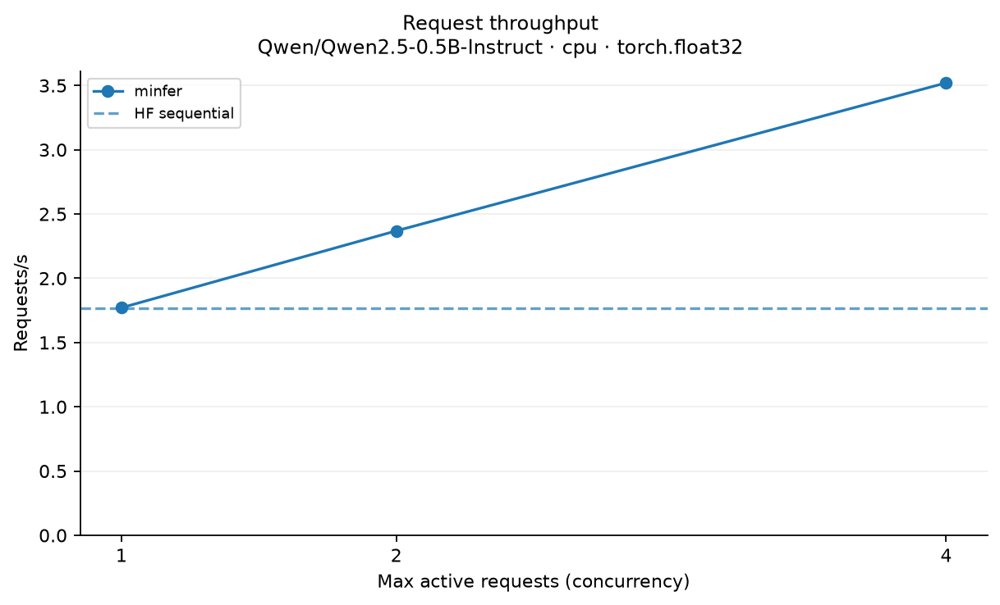
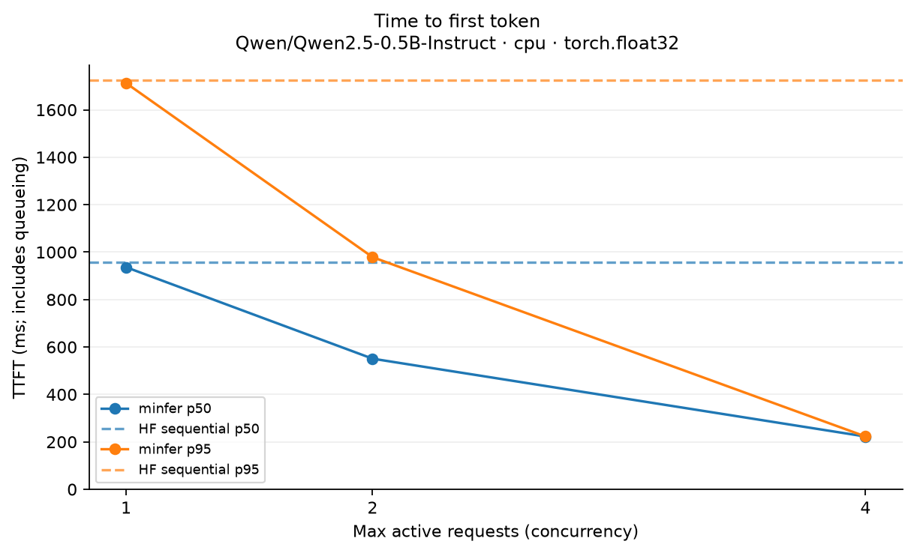
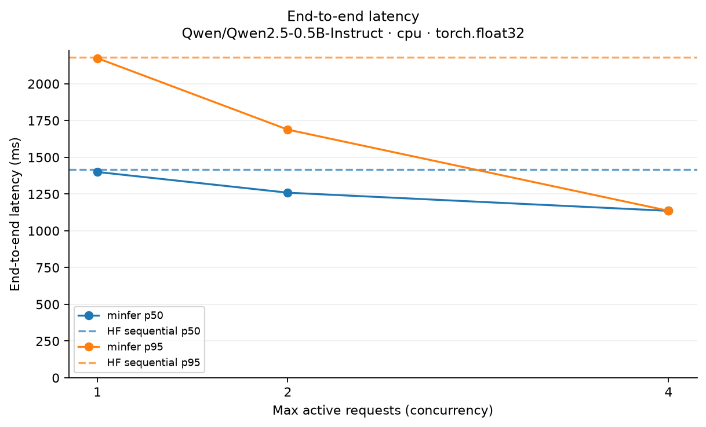
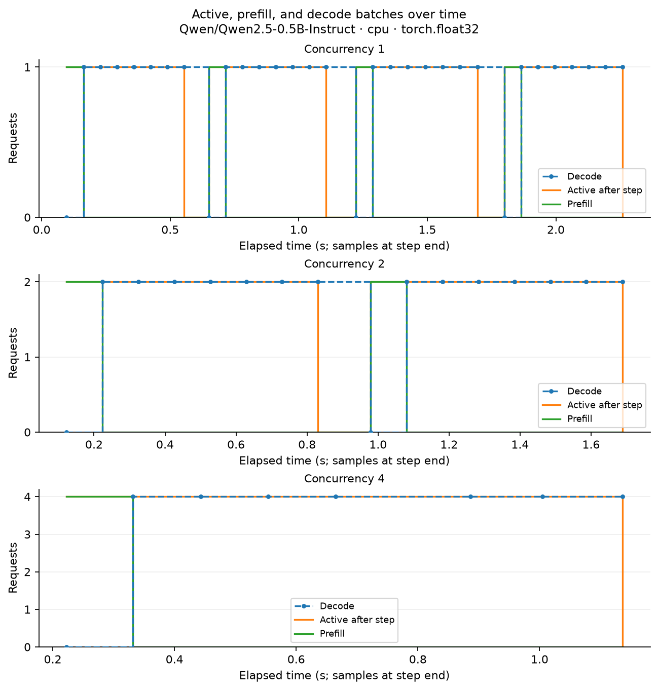

# minfer benchmark report

Source: `cpu-budget-dynamic.json`

- **Model:** Qwen/Qwen2.5-0.5B-Instruct
- **Hardware/platform:** macOS-26.5.1-arm64-arm-64bit
- **Backend:** cpu
- **Dtype:** torch.float32
- **Cache mode:** dynamic
- **Output budget:** 8
- **Prompt token lengths:** [38, 45, 75, 59]
- **Warmup runs:** 1
- **Workload seed:** 42
- **Arrival interval (s):** 0.0
- **Per-step token limit:** 256
- **Logical KV limit:** 512
- **KV block size:** 16
- **KV block pool size:** 256
- **PyTorch:** 2.14.1
- **Transformers:** 5.18.0
- **Workload:** 4 requests; same recorded prompts and greedy output budget across methods.

HF sequential is the reference baseline; minfer runs manual prefill/decode. Model loading is excluded. Queueing and tokenization are included. Small-sample percentiles are descriptive; N/A means unavailable.

| Method | Wall (s) | Tokens/s | Requests/s | TTFT p50 (ms) | TTFT p95 (ms) | Latency p50 (ms) | Latency p95 (ms) |
| --- | ---: | ---: | ---: | ---: | ---: | ---: | ---: |
| hf-sequential | 2.27 | 14.12 | 1.77 | 956.19 | 1725.32 | 1416.64 | 2182.16 |
| engine-active-1 | 2.26 | 14.17 | 1.77 | 936.28 | 1712.43 | 1400.21 | 2174.36 |
| engine-active-2 | 1.69 | 18.95 | 2.37 | 550.70 | 978.65 | 1259.30 | 1688.32 |
| engine-active-4 | 1.14 | 28.16 | 3.52 | 222.57 | 222.74 | 1135.90 | 1136.09 |

## Observations

- Generated token throughput changed from 14.17 to 28.16 tokens/s as concurrency changed from 1 to 4.
- p50 TTFT changed from 936.28 to 222.57 ms as concurrency changed from 1 to 4.
- p95 end-to-end latency changed from 2174.36 to 1136.09 ms as concurrency changed from 1 to 4.

## Plots

Unavailable data; plots omitted: Paged KV block utilization over time.
