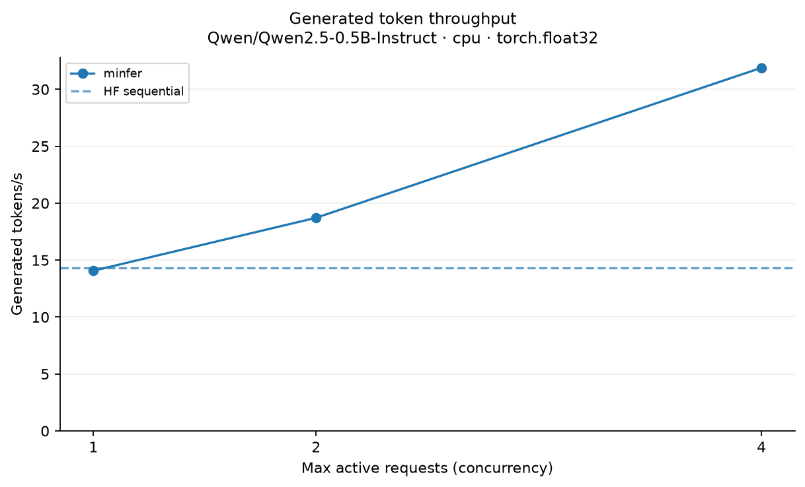
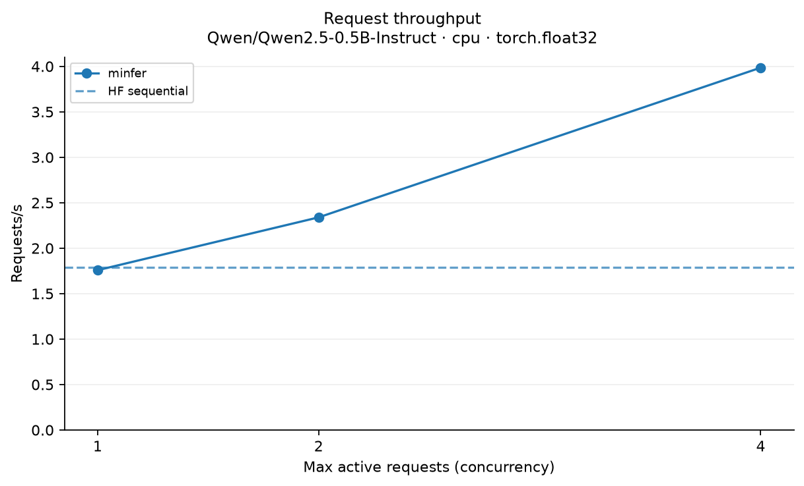
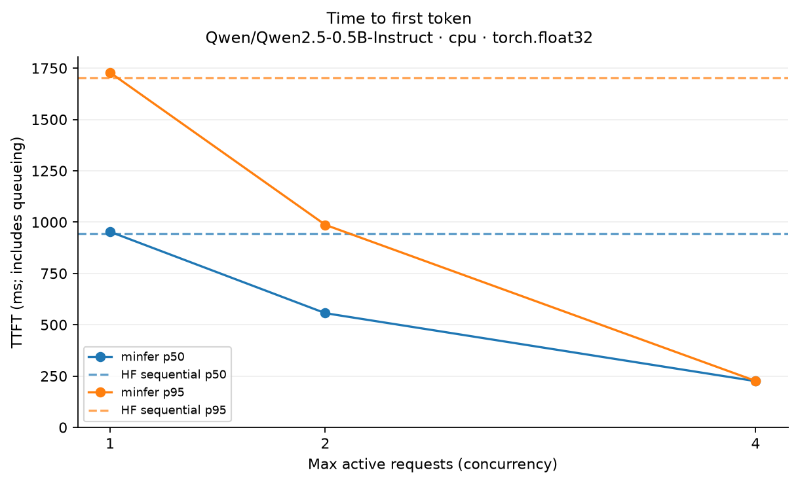
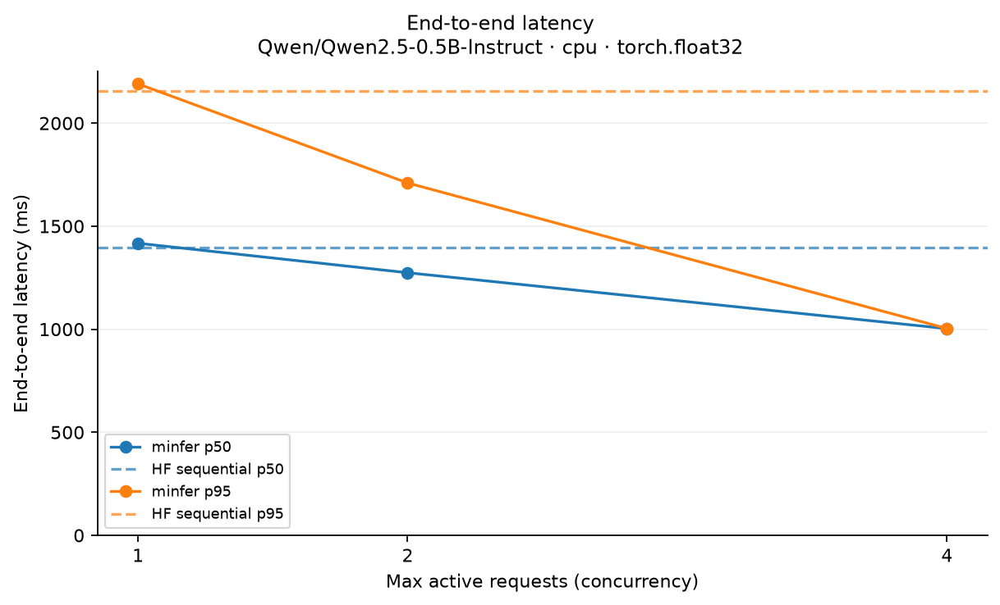
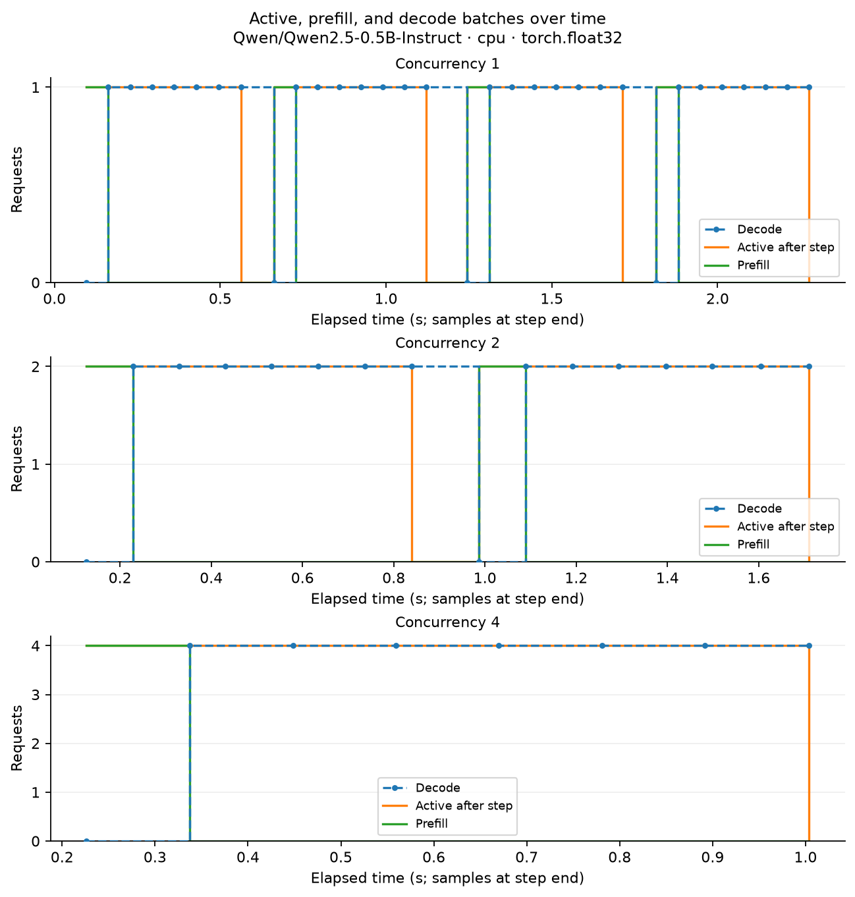
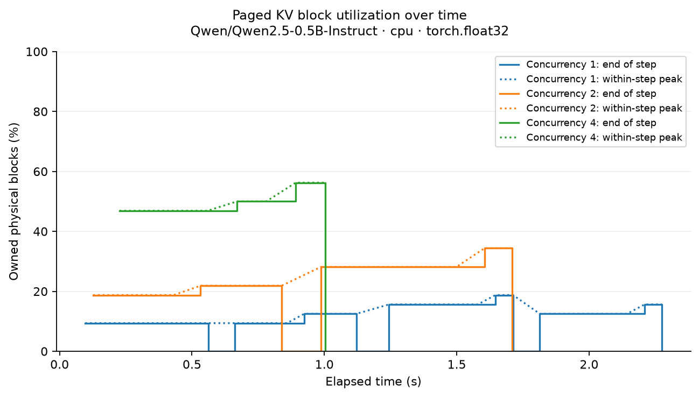

# minfer benchmark report

Source: `cpu-budget-paged.json`

- **Model:** Qwen/Qwen2.5-0.5B-Instruct
- **Hardware/platform:** macOS-26.5.1-arm64-arm-64bit
- **Backend:** cpu
- **Dtype:** torch.float32
- **Cache mode:** paged
- **Output budget:** 8
- **Prompt token lengths:** [38, 45, 75, 59]
- **Warmup runs:** 1
- **Workload seed:** 42
- **Arrival interval (s):** 0.0
- **Per-step token limit:** 256
- **Logical KV limit:** 512
- **KV block size:** 16
- **KV block pool size:** 32
- **PyTorch:** 2.14.1
- **Transformers:** 5.18.0
- **Workload:** 4 requests; same recorded prompts and greedy output budget across methods.

HF sequential is the reference baseline; minfer runs manual prefill/decode. Model loading is excluded. Queueing and tokenization are included. Small-sample percentiles are descriptive; N/A means unavailable.

| Method | Wall (s) | Tokens/s | Requests/s | TTFT p50 (ms) | TTFT p95 (ms) | Latency p50 (ms) | Latency p95 (ms) |
| --- | ---: | ---: | ---: | ---: | ---: | ---: | ---: |
| hf-sequential | 2.24 | 14.30 | 1.79 | 943.84 | 1701.86 | 1397.46 | 2155.08 |
| engine-active-1 | 2.28 | 14.07 | 1.76 | 952.80 | 1728.25 | 1417.13 | 2190.70 |
| engine-active-2 | 1.71 | 18.71 | 2.34 | 556.33 | 986.61 | 1274.16 | 1709.78 |
| engine-active-4 | 1.00 | 31.89 | 3.99 | 225.10 | 226.20 | 1002.95 | 1003.40 |

## Observations

- Generated token throughput changed from 14.07 to 31.89 tokens/s as concurrency changed from 1 to 4.
- p50 TTFT changed from 952.80 to 225.10 ms as concurrency changed from 1 to 4.
- p95 end-to-end latency changed from 2190.70 to 1003.40 ms as concurrency changed from 1 to 4.
- Paged KV block utilization peaked at 56.2%.

## Plots

