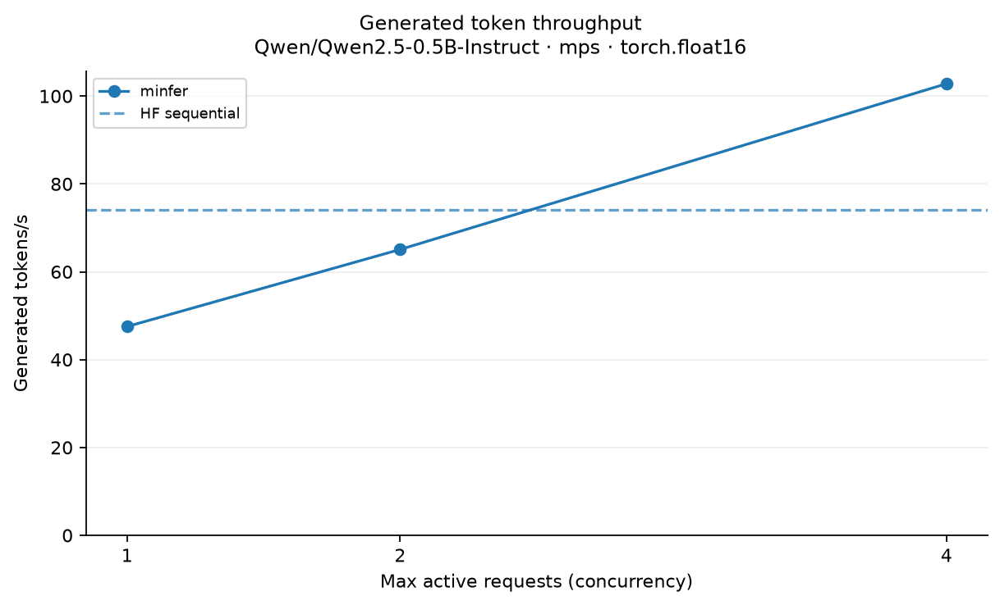
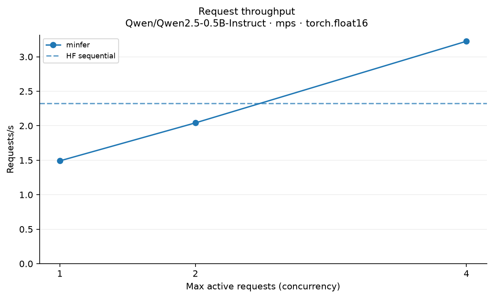
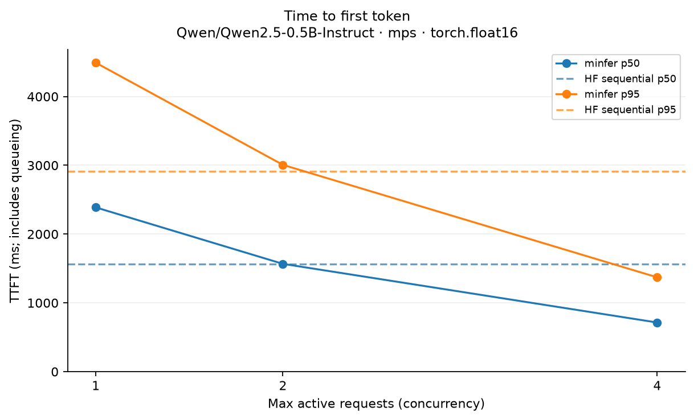
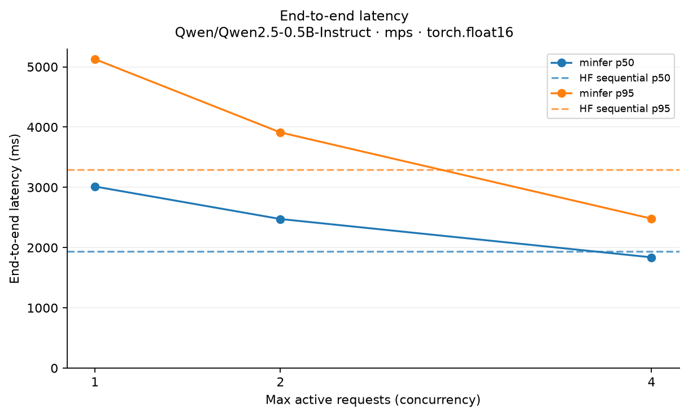
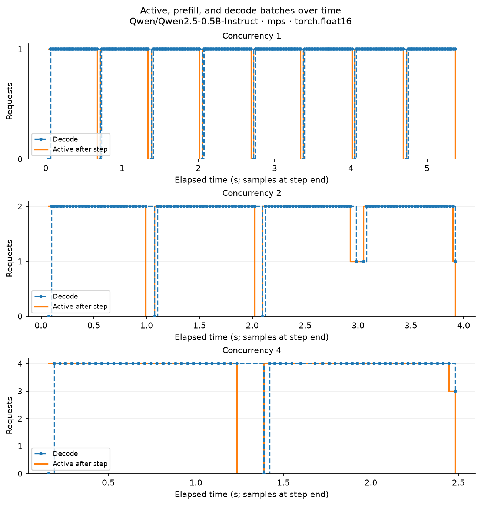

# minfer benchmark report

Source: `mps-historical.json`

- **Model:** Qwen/Qwen2.5-0.5B-Instruct
- **Hardware/platform:** macOS-26.5.1-arm64-arm-64bit
- **Backend:** mps
- **Dtype:** torch.float16
- **Cache mode:** unrecorded
- **Output budget:** 32
- **Prompt token lengths:** [38, 45, 75, 59, 37, 38, 45, 75]
- **Warmup runs:** 1
- **Workload seed:** 42
- **Arrival interval (s):** 0.0
- **Per-step token limit:** unrecorded
- **Logical KV limit:** unrecorded
- **KV block size:** unrecorded
- **KV block pool size:** unrecorded
- **PyTorch:** 2.14.1
- **Transformers:** 5.18.0
- **Workload:** 8 requests; same recorded prompts and greedy output budget across methods.

HF sequential is the reference baseline; minfer runs manual prefill/decode. Model loading is excluded. Queueing and tokenization are included. Small-sample percentiles are descriptive; N/A means unavailable.

| Method | Wall (s) | Tokens/s | Requests/s | TTFT p50 (ms) | TTFT p95 (ms) | Latency p50 (ms) | Latency p95 (ms) |
| --- | ---: | ---: | ---: | ---: | ---: | ---: | ---: |
| hf-sequential | 3.44 | 74.04 | 2.32 | 1564.48 | 2914.44 | 1938.47 | 3290.42 |
| engine-active-1 | 5.37 | 47.53 | 1.49 | 2388.12 | 4492.39 | 3013.57 | 5127.56 |
| engine-active-2 | 3.92 | 65.08 | 2.04 | 1567.32 | 3006.71 | 2473.96 | 3910.89 |
| engine-active-4 | 2.48 | 102.80 | 3.23 | 714.19 | 1371.49 | 1838.31 | 2480.18 |

## Observations

- Generated token throughput changed from 47.53 to 102.80 tokens/s as concurrency changed from 1 to 4.
- p50 TTFT changed from 2388.12 to 714.19 ms as concurrency changed from 1 to 4.
- p95 end-to-end latency changed from 5127.56 to 2480.18 ms as concurrency changed from 1 to 4.

## Plots

Unavailable data; plots omitted: Paged KV block utilization over time.
