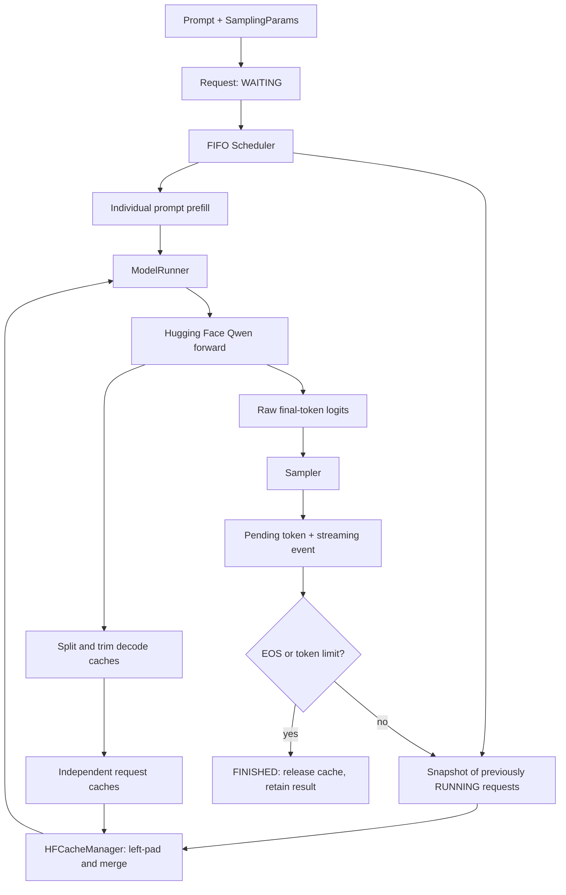

# Architecture and implementation

[← Back to the README](../README.md)

A minimal single-device LLM inference engine inspired by vLLM, built to explore KV caching,
prefill/decode execution, request scheduling, and continuous decode batching.

The canonical model is **Qwen/Qwen2.5-0.5B-Instruct**. Hugging Face loads its tokenizer and
checkpoint and computes `Transformer.forward()`. minfer owns the autoregressive loop,
per-request cache lifecycle, FIFO scheduling, sampling, stopping, and streaming events.
There is no `model.generate()` or generation pipeline inside `src/minfer`.

This is an educational engine, not a reimplementation of production vLLM. The ordinary
padded DynamicCache mechanism here is **not PagedAttention**.

## Contents

- [Runtime setup and CLI](#runtime-setup-and-cli)
- [Python API and streaming](#python-api)
- [Module responsibilities](#architecture)
- [Autoregression and cache invariants](#autoregression-prefill-and-decode)
- [Ragged caches and token positions](#ragged-cache-batching)
- [Scheduler step semantics](#scheduler-step-semantics)
- [Sampling](#sampling)
- [Tests and validation](#tests-and-checks)
- [Benchmark methodology](#benchmarks)
- [Limitations and next extension](#limitations-and-next-extension)

## Runtime setup and CLI

From the repository root, with [uv](https://docs.astral.sh/uv/) installed:

```bash
uv sync --locked
uv run minfer generate \
  --model Qwen/Qwen2.5-0.5B-Instruct \
  --prompt "Explain KV caching" \
  --max-new-tokens 64 --temperature 0
```

The first run downloads the checkpoint. To keep both dependency and model downloads in
this repository (also useful in restricted environments), run these once in your shell:

```bash
export UV_CACHE_DIR="$PWD/.cache/uv"
export HF_HOME="$PWD/.cache/huggingface"
```

Automatic device selection is CUDA → MPS → CPU. Defaults are CUDA bfloat16 when supported
(otherwise float16), MPS float16, and CPU float32. Override with `--device cpu`,
`--device mps`, `--device cuda:0`, or `--dtype float32`. Device selection raises an explicit
error for unavailable backends. In a sandbox, MPS may appear unavailable even when the
host supports it; run in a terminal with normal device access to test MPS.

The CLI uses Qwen's instruction chat template by default; `--raw-prompt` disables it.
It streams text deltas immediately. With repeated prompts, each text fragment has a
request-number label:

```bash
uv run minfer generate --prompt "Explain prefill" --prompt "Explain decode" \
  --max-active-requests 2 --max-new-tokens 32
uv run minfer generate --prompt "Write a short story" --temperature 0.8 \
  --top-k 40 --top-p 0.9 --seed 42 --max-new-tokens 64
```

The resolution in [uv.lock](../uv.lock) was tested with Python 3.12, PyTorch 2.14.1,
Transformers 5.18.0, and tokenizers 0.23.2. Narrow dependency ranges preserve the tested
cache API generation; use the lockfile for exact versions. No FlashAttention dependency
or unconditional CUDA operation is required. PyTorch SDPA is used for attention.

## Python API

```python
from minfer import LLMEngine, SamplingParams

engine = LLMEngine(max_active_requests=4)
params = SamplingParams(max_new_tokens=64, temperature=0)
request_id = engine.add_request("Explain continuous batching.", params)

while engine.has_unfinished_requests():
    for event in engine.step():
        print(event.token_text, end="", flush=True)

result = engine.get_result(request_id)
print(result.finish_reason, result.latency, result.ttft)

# Convenience APIs still run the same scheduler and cached loop.
result = engine.generate("Explain KV caching.", params)
results = engine.generate_batch(["Explain prefill.", "Explain decode."], params)
```

`TokenEvent` contains `request_id`, `token_id`, `token_text`, `finished`, and
`finish_reason`. Text is a delta, not the entire generated string. The decoder buffers
incomplete trailing Unicode characters until more bytes arrive. An EOS token may emit
empty text while still producing a terminal event. `GenerationResult` retains the final
text, generated token IDs (including terminal EOS), finish reason, latency, and TTFT.
Times use a monotonic clock in seconds, measured from request submission; queueing and
tokenization are included. Results and request records remain available for inspection.

`abort_request(id)` cancels waiting or active work, releases the cache, and returns a
terminal event (`token_id=None`). It does not enqueue that event for a later `step()`.
The engine is synchronous and intended for one calling thread. Add requests between
steps; the convenience APIs drain all outstanding work, including previously queued
requests. Inspect an active record with `get_request(id)` without modifying its state.

See [generate.py](../examples/generate.py) and [dynamic_batch.py](../examples/dynamic_batch.py):

```bash
uv run python examples/generate.py
uv run python examples/dynamic_batch.py
```

## Architecture



| File | Responsibility |
| --- | --- |
| `config.py` | Validated `EngineConfig` and immutable `SamplingParams` |
| `request.py`, `events.py` | Typed lifecycle records, token events, final results |
| `device.py` | Selection, dtype, synchronization, current device memory |
| `model_runner.py` | Loading, tokenization, prefill, one-token decode, independent oracle |
| `cache.py` | All cache layout/API assumptions, validation, merge, split, clone |
| `sampler.py` | Greedy, temperature, top-k, nucleus sampling |
| `scheduler.py` | FIFO queue, active capacity, completion, cancellation |
| `engine.py` | Step boundaries, state updates, events, convenience generation |
| `cli.py` | Streaming terminal interface |
| `benchmarks/` | External HF reference, workloads, synchronized measurements and reports |

## Autoregression, prefill, and decode

A causal language model predicts the next token from the tokens before it. After choosing
that token, generation repeats. A naive loop sends the entire growing sequence through
the model each time, repeating earlier projections and layer computations.

A KV cache stores each attention layer's previously computed keys and values. It does
not store generated text or replace the model. **Prefill** consumes the whole prompt in
one forward pass and creates its cache; the final prompt logits produce the first new
token. **Decode** consumes just one new token with the previous cache and produces the
next token's logits. Attention still reads the history, and the cache grows with it.

`ModelRunner.generate_independent()` is a simple manual single-request oracle. It calls
`prefill()` once, then `decode_one()` on just the pending token. It is tested against a
controlled Hugging Face reference before testing the dynamic engine.

The central invariant for every RUNNING request is:

```text
cache = all tokens already consumed by the Transformer
pending_token = latest generated token, not yet consumed

After prefill:
    cache = prompt                        pending = first generated token
After one decode:
    cache = prompt + first generated token pending = second generated token

cache length = prompt length + number of generated tokens - 1
```

The final token never needs to be consumed after EOS or the token budget ends. Finished
and aborted requests release their caches immediately. EOS takes precedence over length
if both conditions hold. Prompt plus consumed decode history must fit the model context
limit; there is no automatic truncation.

## Ragged cache batching

Static batching fixes membership for a generation run. Continuous decode batching
rebuilds membership each scheduler iteration: new requests can join, finished requests
leave, and available slots take waiting requests. Different prompt lengths and generation
ages mean the caches cannot simply be concatenated along their batch dimension.

At rest, each request owns a separate batch-size-one full-attention DynamicCache. For
history lengths 10, 6, and 14, `HFCacheManager.merge()` makes temporary layer tensors:

```text
A: [4 padding columns | 10 genuine cache columns]
B: [8 padding columns |  6 genuine cache columns]
C: [                    14 genuine cache columns]

K and V at each layer: [3, kv_heads, 14, head_dim]
input_ids:             [3, 1] (one pending token per request)
attention_mask:        [3, 15] (zeros over padding; ones over history + current token)
position_ids:          [[10], [6], [14]]
```

Cached keys already have their semantic RoPE positions; moving their storage columns
does not change those rotations. The current token's **semantic** position is its true
history length, while its **physical** append column is 14 for all three rows.
Transformers 5.18's Qwen forward no longer accepts an explicit `cache_position` parameter:
its DynamicCache provides the physical query offset for causal masking. We provide the
distinct semantic `position_ids` and the explicit two-dimensional padding mask. This
is the small API adjustment from older examples using `cache_position`.

One batched forward appends the consumed token at the end of the temporary cache.
`split()` selects each row and removes exactly the padding introduced by `merge()`.
Its persistent length becomes 11, 7, or 15. Split tensors are cloned so a short-lived
row does not retain the entire merged batch's memory through a tensor view. This copying
and padding overhead is intentional and makes the design easy to inspect.

Tests verify logits, greedy token IDs, layer K/V values, true lengths, and one actual
`[B, 1]` forward per decode iteration over five consecutive steps. A test fills masked
padding with large nonzero values to prove attention excludes it. Tests also compare
the full batched engine with independent generation on deliberately unequal prompts.
Only full-attention caches are supported; sliding-window models are explicitly rejected.

## Scheduler step semantics

At the start of `step()`, the engine snapshots currently running requests and admits
FIFO waiting requests into the slots available at that boundary. New admissions each
perform an individual prefill and emit at most their first generated token. Then the
previously running snapshot consumes one pending token per request in one decode call.

New admissions are excluded from that step's decode snapshot, so **every request emits
at most one token per call**. Completions remove active records immediately, and their
slots can admit waiting work on the next call. Capacity never exceeds
`max_active_requests`, including when new requests finish on their first token.
Cache-invalidating forward failures abort the affected work and propagate the exception.

Prefill is deliberately individual and can delay older requests' decode/TTFT. There is
no chunked prefill or mixed prefill/decode kernel.

## Sampling

`temperature=0` selects the raw argmax and does not advance RNG state. Otherwise the
sampler scales logits by temperature, retains top-k (0 disables it), then applies top-p
to the remaining distribution. Nucleus filtering keeps the token crossing the threshold
and always retains at least one candidate.

Each request owns a CPU `torch.Generator`. Sampling uses CPU float32 probabilities for
portable RNG support on MPS. A seed gives an independent random stream, avoiding dependence
on unrelated requests' RNG draws. Small numerical differences between backend/dtype or
batched kernels can still affect categorical samples or nearly tied greedy logits;
reproducibility is within controlled settings, not a cross-device guarantee.

## Tests and checks

```bash
uv run pytest                         # fast tests, no checkpoint downloads
uv run pytest -m integration          # real Qwen CPU and MPS cases; MPS skips if unavailable
uv run pytest -m integration -k cpu    # only the CPU integration cases
uv run pytest -m integration -k mps    # only the MPS integration cases
uv run ruff check .
uv run ruff format --check .
uv build
```

Fast tests use synthetic tensors, mock sampling, and a tiny randomly initialized
Hugging Face Qwen2 model (not a custom Transformer). They cover greedy reference parity,
cached decoding, ragged caches, lifecycle invariants, FIFO/capacity, late arrivals, aborts,
failure cleanup, EOS/length stopping, Unicode streaming, and seeded sampling.

Integration tests reuse one checkpoint per backend. They compare controlled greedy
`model.generate()` with manual generation, full-sequence with cached logits, ragged
multi-step logits/caches, and engine outputs with independent requests. Reference
configuration explicitly disables Qwen's saved repetition penalty of 1.1; comparing
against its unmodified generation defaults would compare different algorithms.

CPU float32 logit tolerance is `atol=rtol=1e-4` on the full checkpoint, tighter on the
tiny model. MPS float16 uses `3e-2`, and greedy token IDs must still match exactly.

Validated on 2026-10-01: 30 fast tests and all 8 canonical-model integration cases
passed across CPU float32 and Apple Silicon MPS float16. CLI generation, locked uv
installation, Ruff checks, and wheel/source builds were also verified. CUDA is supported
by the device abstraction but was not available for testing on this machine.

## Benchmarks

```bash
uv run python -m benchmarks.benchmark --device auto --requests 8 \
  --concurrency 1 2 4 8 16 --max-new-tokens 32 --warmup 1 \
  --seed 42 --output benchmark-results.json

# Include synthetic arrivals after earlier decode work starts:
uv run python -m benchmarks.benchmark --device auto --requests 8 \
  --concurrency 1 2 4 --arrival-interval 0.1 --max-new-tokens 32 \
  --output benchmark-arrivals.json
```

Run benchmark modules from the repository root. `--prompts prompts.json` accepts a JSON
array of strings. The default seeded workload mixes short, medium, and longer prompts.
`--threads` controls CPU intra-op threads (default 4). Select capacities that fit your
device's memory; the benchmark does not silently skip OOMs.

Methods are sequential HF `model.generate()`, this engine with capacity 1, and this engine
at requested capacities. All methods use the same model instance, workload, output
budget, and controlled greedy/EOS settings. There is no padded static HF baseline here.
Every engine method must produce the same token sequences as the HF reference, or the
benchmark fails. Warmup runs precede each measurement; model loading is excluded.

The table and JSON record total wall time, requests/s, generated tokens/s, per-request
latency and TTFT, and p50/p95 interpolated percentiles. A custom reference streamer times
HF's first generated token. CUDA/MPS synchronization occurs at measurement boundaries
and reference first-token timestamps. Queueing, tokenization, stream-decoding overhead,
and scheduled arrival waiting are included; output rendering to the terminal is excluded.
With synthetic arrivals, timestamps start at the scheduled arrival even if a scheduler
step notices it later. This exposes queueing between steps. The seed orders prompts;
generation is greedy.

Percentiles are N/A with fewer than two samples and only descriptive with small samples.
JSON device memory is **current allocated tensor memory after the run**, not peak
allocation or process RSS. CPU memory is `null` (N/A). Results are workload-specific and
should not be interpreted as evidence of production performance or superiority to vLLM.

Measured reports from this implementation are stored in [benchmarks/results/](../benchmarks/results/) with the
versions, dtype, platform, prompt lengths, workload, seed, warmup, and per-request results.

Engine JSON rows also include an `iteration_trace` with stable zero-based workload
indices, the running set before/after each step, prefilled/completed requests, waiting
count, and actual decode batch size. Use it to inspect requests joining and leaving
under `--arrival-interval`.

## Limitations and next extension

Individual prefill; ordinary growing DynamicCaches; temporary padding and tensor copies;
no prefix caching, chunked prefill, preemption, swapping, quantization, CUDA graphs,
custom attention kernels, PagedAttention, paged KV allocator, beam search, speculative
decoding, tensor/pipeline parallelism, distributed execution, training, or serving server.
Only Qwen2.5-0.5B-Instruct is verified. Completed request histories/results accumulate
for inspection; construct a new engine (reusing a runner if desired) for a new long-lived
experiment. Streaming decodes the generated prefix to determine its delta, which favors
correctness and simplicity over optimal text-decoding cost.

The next educational extension is a real paged KV block allocator with fixed-size blocks,
logical block tables, and allocation/freeing. It would also need a compatible attention
path to read those blocks; an allocator alone would not implement PagedAttention. Keep
that future work behind the cache subsystem, after understanding the V1 copy/padding costs.
